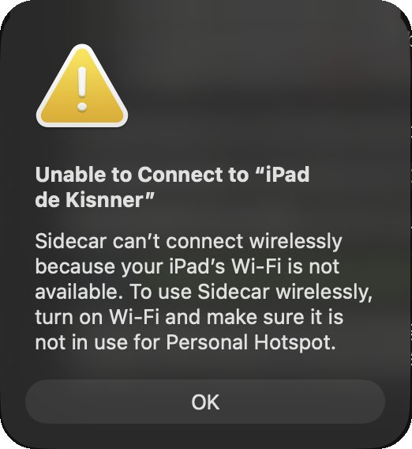
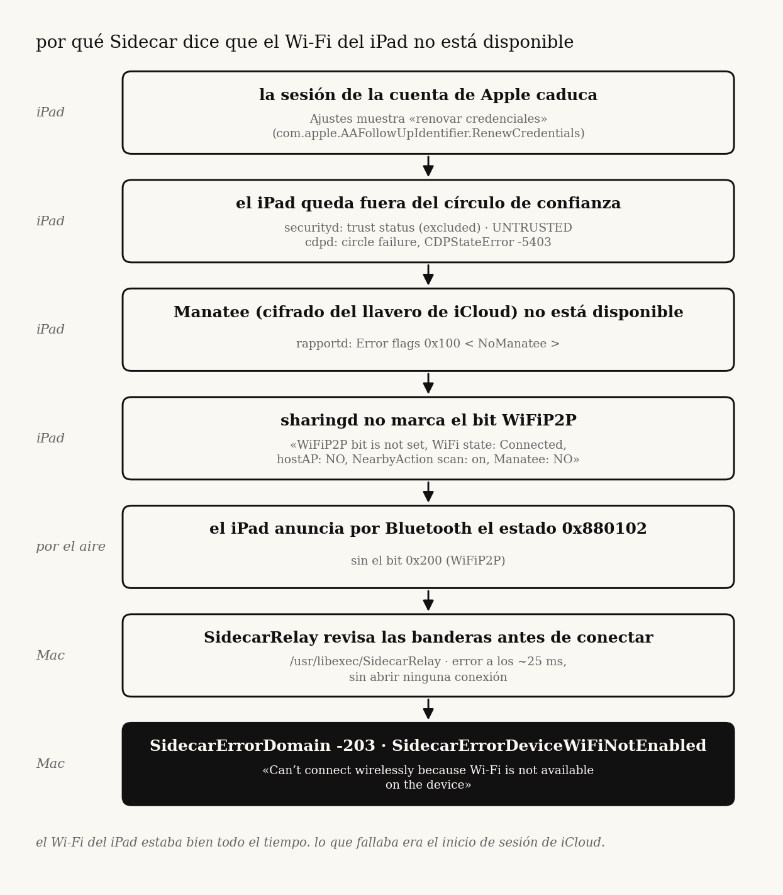
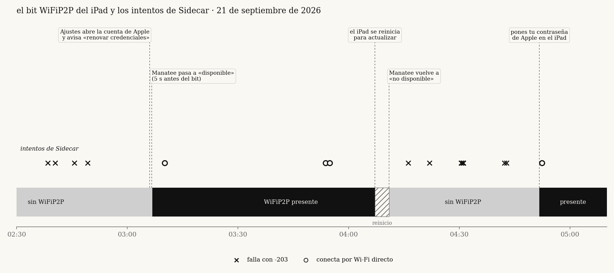

<p align="center"></p>

# sidecar-wifi-macos27

**[english version](README.en.md)** · **[writeup en inglés](writeup.md)**

por qué sidecar decía que el wi-fi del ipad no estaba disponible, con el wi-fi perfecto. **resuelto.**

el error, tal cual: *«no se puede conectar a "ipad"»* / *«sidecar can't connect wirelessly because your ipad's wi-fi is not available. to use sidecar wirelessly, turn on wi-fi and make sure it is not in use for personal hotspot»*. en el registro: `SidecarErrorDomain Code=-203 "SidecarErrorDeviceWiFiNotEnabled"`. por cable sí funciona.

<sub>captura real del error, en un macbook pro con macos 27.2 y un ipad pro con ipados 27.</sub>

## la causa

el wi-fi nunca fue el problema. la sesión de la cuenta de apple del ipad había caducado (ajustes mostraba «renovar credenciales»). con la sesión así, el llavero de icloud (manatee) queda sin disponibilidad, y el ipad, por diseño, **deja de anunciar el bit `WiFiP2P` por bluetooth**. el mac lo lee y aborta con `SidecarErrorDomain -203` a los 25 ms, antes de intentar conectar nada. el mensaje del sistema es engañoso.

<p align="center"></p>

## el arreglo

en el ipad, completar el aviso de la cuenta de apple:

1. **ajustes → tu nombre**: si pide «actualizar los ajustes de la cuenta de apple» o volver a iniciar sesión, completarlo (contraseña, código de verificación, código del ipad o del iphone si lo pide).
2. **iCloud → contraseñas y llavero**: debe estar activado.
3. si sigue igual: cerrar sesión de la cuenta en el ipad y volver a entrar.

no sirve apagar y encender wi-fi o bluetooth, reiniciar, cambiar de banda, quitar la vpn, cargar el ipad ni actualizar el sistema.

## la prueba

el bit del ipad, medido cada segundo desde el mac, contra cada intento de conectar. las conexiones caen todas dentro de las ventanas con el bit; las fallas, todas fuera.

<p align="center"></p>

- a las **03:06** el ipad mostró una alerta de icloud y pidió el código del ipad y luego el del iphone; 5 s después de que manatee pasó a «disponible», apareció el bit y sidecar conectó.
- a las **04:07** el ipad se reinició para actualizar, volvió a pedir la contraseña de la cuenta, y el bit desapareció otra vez.
- a las **04:51** se puso la contraseña, el bit volvió y sidecar conectó por wi-fi directo.

todo eso está en los registros del propio ipad, no en suposiciones: [notes/investigacion.md](notes/investigacion.md).

## diagnosticar en tu equipo

```bash
swiftc -O tools/sidecar-probe.swift -o sidecar-probe
./sidecar-probe status      # ¿anuncia WiFiP2P? (código de salida 0 si sí, 3 si no)
./sidecar-probe watch       # avisa en cada cambio del bit
./sidecar-probe connect     # intenta conectar y muestra el error exacto
```

para ver desde el ipad por qué no lo anuncia (necesita cable y contraseña de administrador):

```bash
sudo log collect --device-udid <UDID> --last 10h --output /tmp/ipad.logarchive
sudo chown -R "$USER" /tmp/ipad.logarchive
./tools/ipad-why.sh /tmp/ipad.logarchive
```

la salida enmascara correos, identificadores de cuenta, udid y direcciones. los registros originales tienen datos personales: bórralos al terminar.

## qué hay aquí

| | |
|---|---|
| [notes/investigacion.md](notes/investigacion.md) | cronología, hipótesis descartadas con su evidencia, causa y límites |
| [notes/arquitectura.md](notes/arquitectura.md) | cómo decide sidecar: `SidecarRelay`, `rapportd`, `sharingd` |
| [evidence/](evidence) | extractos de registros del ipad y del mac, ya enmascarados |
| [tools/](tools) | `sidecar-probe` (api privada `SidecarCore`) e `ipad-why.sh` |

## límites

- probado en un macbook pro (`MacBookPro17,1`, macos 27.2, `26B5086k`) con un ipad pro 12.9" 5ª gen (`iPad13,10`, ipados 27.0 y 27.2). no sé si aplica igual a otros modelos.
- `sidecar-probe` usa una api privada de apple: es solo para diagnóstico y puede dejar de funcionar sin aviso.
- no capturé los registros del ipad del momento exacto en que se puso la contraseña (04:51); ese instante solo está observado desde el mac.
